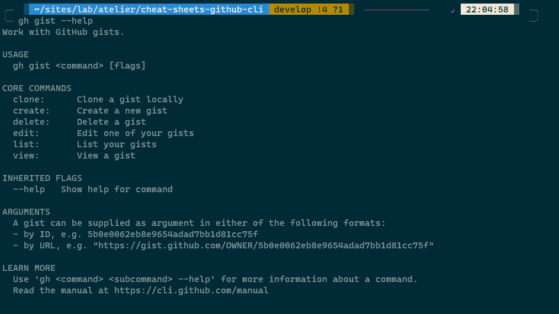

<a href="README.md">Table des Matières</a>

# Gestion des Gists GitHub avec GitHub CLI

### Qu'est-ce qu'un Gist ?

Les gists sont un moyen simple de partager des extraits de code et d'autres petits morceaux de texte avec d'autres. Tandis que les dépôts GitHub sont destinés à des projets plus grands. Les gists sont idéaux pour des morceaux de code isolés, des scripts, des notes ou des snippets. 

Chaque gist est sauvegardé dans un dépôt Git, ce qui signifie qu'ils peuvent être versionnés, forkés et clonés.

Les gists peuvent être créés soit en tant que fichiers publics que tout le monde peut voir et partager, soit en tant que fichiers privés.

### Création d'un Gist

Pour créer un nouveau gist :

```bash
gh gist create <filename>
```

- `<filename>` : le fichier que vous souhaitez télécharger en tant que gist.


### Lister vos Gists

Pour voir la liste de vos gists :

```bash
gh gist list
```

### Voir un Gist

Pour afficher le contenu d'un gist :

```bash
gh gist view <gist-id>
```
 `<gist-id>` : l'identifiant du gist que vous souhaitez visualiser.


### Éditer un Gist

Pour éditer un gist existant :

```bash
gh gist edit <gist-id>
```

`<gist-id>` : l'identifiant du gist que vous souhaitez éditer.


### Cloner un Gist

Pour cloner un gist dans un répertoire local :

```bash
gh gist clone <gist-id>
```
`<gist-id>` : l'identifiant du gist que vous souhaitez cloner.

### Supprimer un Gist

Pour supprimer un gist :

```bash
gh gist delete <gist-id>
```

- `<gist-id>` : l'identifiant du gist que vous souhaitez supprimer.

### Gist Help 

L'utilisation de `gh` pour les gists permet une intégration fluide et rapide avec votre flux de travail en ligne de commande. Pour plus de détails sur les commandes `gh gist`, vous pouvez toujours exécuter :

```bash
gh gist --help
```

<p align="center"></p>
<br>