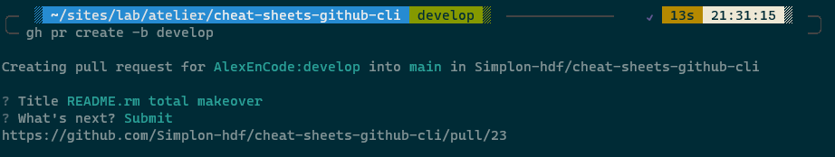

<a href="README.md">Table des Matières</a>
# Les bases de l'utilisation de GitHub CLI

Les lignes de commandes GitHub CLI, doivent être utilisée pour gagner du temps et éviter de changer de contexte, et d'interface.

### Les commandes de bases

Entrez <code>gh status</code> pour voir les détails de votre travail actuel sur GitHub dans tous les référentiels.

``` 
gh status
```
Entrez <code>gh help</code> pour obtenir de l'aide directement dans l'application.
```
gh help
 ```

### Personnaliser son GitHub CLI

Pour adapter son GitHub CLI de la manière qui convient le mieux, il est possible de configurer et ajouter des alias et des extensions.

pour configurer les paramètres de GitHub CLI, entrez <code>gh config set SUBCOMMANDS</code>, en remplacant SUBCOMMANDS par le paramètre à ajuster.

Par exemple, pour redéfinir votre éditeur de texte sur Visual Studio Code, entrez:
```
 gh config set editor "code -w" 
 ```
Dans ce cas l'indicateur <code>-w</code> fait en sorte que la commande attende que le fichier soit fermé dans Visual Studio Code avant de passer à l'étape suivante dans votre terminal.

### Travailler sur les repo GitHub

Pour créer un nouveau dépôt, utilisez la commande <code>gh repo create</code>.
```
gh repo create
```

Pour fork un dépôt, utilisez la commande <code>gh repo fork</code>.
```
gh repo fork
```

 <code>--add-readme</code>: cré un fichier README dans le dépôt.

 <code>-c </code>, <code>--clone </code>: Clone le dépôt.

 <code>-d </code>, <code>--description < string > </code>: Description du dépôt.

 <code>-g </code>, <code>--gitignore < string > </code>: génère un gitignore pour le dépôt.

<code>--private </code> ou <code>--public </code>: rend le dépôt privé/public.

<code>--push </code> Push le commits dans le dépôt.

### Génération des Issues

Pour générer un "issue" utilisez la commande <code>gh issue create</code>.
Il est possible d'y ajouter un titre (<code>--title "your text"</code>), un corp (<code>--body "your text"</code>), ou encore un label (<code>--label "your text"</code>).
```
gh issue create
```

### Création des Pull Request

Pour créer un Pull Request utilisez la commande <code>gh pr create</code>, puis suivre les instructions dans le Terminal.
```
gh pr create
```
<p align="center"></p>
<br>
Il est possible de lister les Pull Request en cour avec la commande <code>gh pr list</code>. 
```
gh pr list
```
La liste indiquera le numéro de la Pull Request à utilister dans le Terminal. Par exemple pour voir le Pull Request, utilisez la commande <code>gh pr view 1</code>, pour voir la première Pull Request.

Pour voir les conflits entre la branche principale et la Pull Request, utilisez la commande <code>gh pr diff 1</code> (pour le premier Pull Resquest).

Il est aussi possible de commenter la commande <code>gh pr comment 1 "your text"</code>.

Lorsque le  Pull Request est terminée, il est possible de le fermer avec la commande  <code>gh pr close 1</code> (pour le premier Pull Request).
```
gh pr close 1 -d
```
Il sera possible de réouvrire le Pull Request avec <code>gh pr reopen 1</code>.

A tout moment, il est possible de verifier le status du Pull Request avec la commande <code>gh pr status</code>

<br>

## Les extensions CLI

Les extensions CLI GitHub sont des dépôts qui fournissent des commandes gh supplémentaires.

Les noms d'extensions comment par <code>gh-</code> et doivent contenir un executable du même nom. 

La commande <code>gh extension brows [flags]</code> permet de rechercher, ajouter ou retirer vos extensions GitHub.
 ```
gh extension brows
```
Elles sont utilisées pour chatouiller la rétine de l'utilisateur, avoir des informations complémenteur depuis GitHub CLI, ou même pour chater et faire des graphiques! Les extensions sont nombreuses, et vous y trouverez forcement votre bonheur pour pimper votre CLI.

Vous trouverez une liste d'extensions à ce lien: [Page des extensions GitHub CLI](https://github.com/topics/gh-extension/) .


### Installer des extensions

Pour installer une extensions, utilisez la commande <code>gh extensions install (url du repo)</code>. par exemple, pour l'extention "whoami":
```
gh extension install https://github.com/mislav/gh-branch
```

Vous trouverez de super extensions sur ce dépôt : [Page d'extensions communes](https://github.com/kodepandai/awesome-gh-cli-extensions) .

## Astuces pour GitHub CLI

Utiliser GitHub CLI (`gh`) peut rendre votre flux de travail plus rapide et plus direct. Voici quelques astuces pour les développeurs qui débutent avec `gh`.

### Authentification simplifiée

Utilisez SSH pour l'authentification :

```bash
gh auth login -h github.com -p ssh
```

### Navigation rapide

Ouvrez le dépôt actuel dans votre navigateur avec :

```bash
gh repo view --web
```

### Travail avec les issues

Listez les issues assignées à vous dans le dépôt actuel :

```bash
gh issue list --assignee @me
```

Créez une issue en spécifiant un titre et le corps directement :

```bash
gh issue create --title "Titre de l'issue" --body "Description de l'issue"
```

## Gestion des Pull Requests (PR)

Créez une pull request et remplissez automatiquement le titre et le corps avec les informations du commit :

```bash
gh pr create --fill
```

Listez les PRs qui demandent votre avis (en tant que reviewer) :

```bash
gh pr list --reviewer @me
```

### Alias pour les commandes longues

Créez des alias pour simplifier les commandes longues ou fréquentes. Par exemple, définissez un alias pour lister les PRs :

```bash
gh alias set prl 'pr list --limit 10'
gh prl
```
<p align="center"></p>
<br>

### Scripts et automatisation

Intégrez `gh` dans vos scripts pour automatiser les tâches GitHub. Par exemple, un script pour cloner et naviguer dans un dépôt :

```bash
$ !/bin/bash

gh repo clone utilisateur/repo && cd repo && gh repo view --web
```

### Consulter et télécharger les Releases

Listez les dernières releases :

```bash
gh release list
```

Téléchargez des assets spécifiques de la dernière release :

```bash
gh release download --pattern "*.zip"
```